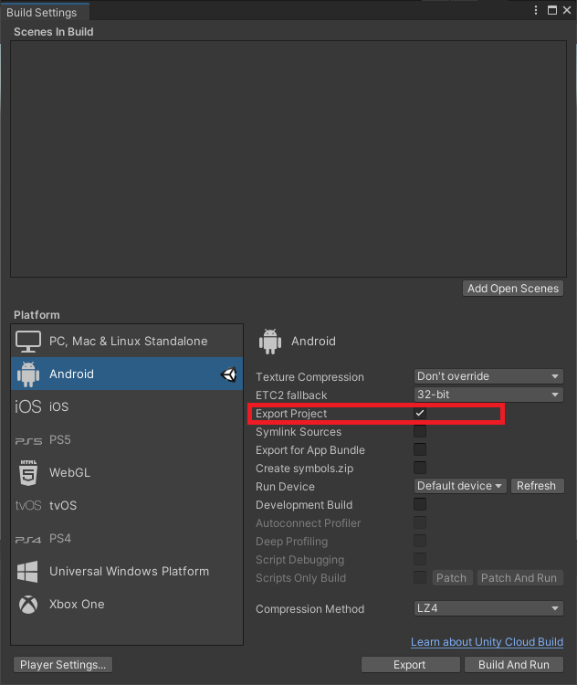
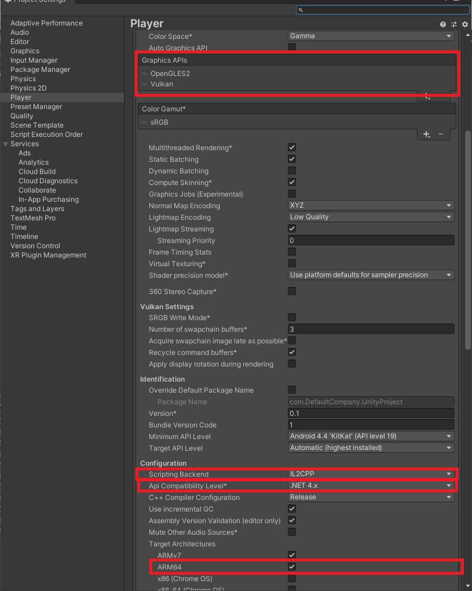
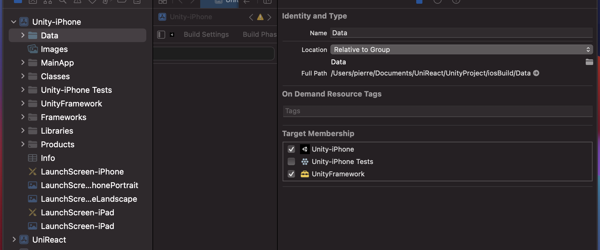
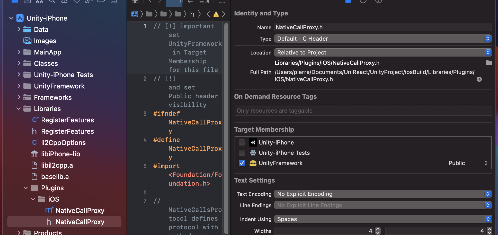
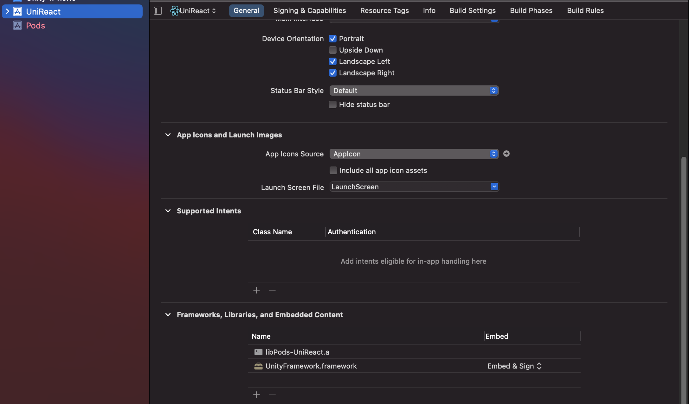
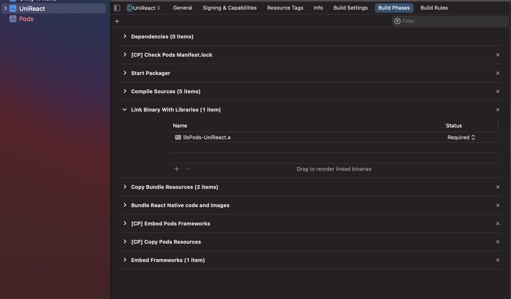

Unity

# Unity

Copy Script "UnityMessageManager.cs"  to project
this script create a global "UnityMessageManager" insatance to magage messages

In any game object' script

```c#
void Awake()
{
    ...
    //register Message handler
    UnityMessageManager.Instance.OnRNMessage += onMessage;
}
void onDestroy()
{
    ...
    //unregister Message handler
    UnityMessageManager.Instance.OnRNMessage -= onMessage;
} 
void onMessage(MessageHandler message)
{
    //send callback to messages
    var data = message.getData<string>();
    message.reply(new { CallbackTest = "I am Unity callback" });
}
void myExposedFunction(string val)
{
    ...
    //Send Message to RN
     UnityMessageManager.Instance.SendMessageToRN(new UnityMessage(){
            name = "click",
            data = JObject.FromObject(
                new {
                    colors = colors[CurrentColorIndex].ToString() ,
                    clickCount = clickCount 
            }),
            callBack = (data) =>{
                Debug.Log("onClickCallBack:" + data);
            }
        });
    ...
}

```

### Export Settings

in build settings, check "Export project"



export unity project to ./androidBuild

# Android

build.gradle

```java
allprojects {
    repositories {
       ... 
                flatDir {
            dirs "${project(':unityLibrary').projectDir}/libs"
        }
        flatDir {
            dirs 'libs'
        }
        ...
    }
}
```

gradle.properties

```java
unityStreamingAssets=.unity3d, google-services-desktop.json, google-services.json, GoogleService-Info.plist
```

settings.gradle

```java
...
include ':unityLibrary'
project(':unityLibrary').projectDir=new File('..\\..\\UnityProject\\androidBuild\\unityLibrary')

```

app/build.gradle

```java
dependencies {
    implementation project(':unityLibrary')
    implementation fileTree(dir: project(':unityLibrary').getProjectDir().toString() + ('\\libs'), include: ['*.jar'])
  ...
 }
```

android\\app\\src\\main\\java\\com\\samplereactnativeapp\\MainApplication.java

```java
...
@Override
protected List<ReactPackage> getPackages() {
    ...
  packages.add(new UnityViewPackage());
  return packages;
}
...
```

copy files :

- UnityEventListener.java
- UnityNativeModule.java
- UnityUtils.java
- UnityView.java
- UnityViewManager.java
- UnityViewPackage.java
  
into android\\app\\src\\main\\java\\com\\samplereactnativeapp


# IOS
open react native ios project with xcode

create workspace

add iosBuild/Unity-IPhone.xproj to workspace

set Unity-Iprone/Data folder menbership to UnityFramework



set Unity-Iprone/Library/Plugins/NativeCallProxy.h visibility to public
 

Add UnityFramework in RN project

Remove UnityFramework from Link Binary with libraries


copy files :

 - UnityModule.h
 - UnityModule.m
 - UnityView.h
 - UnityView.m
 - UnityViewManager.h
 - UnityViewManager.m

into ios/[ProjectName]

AppDelegate.m

```ObjectiveC
...
#include <UnityFramework/UnityFramework.h>
#include <UnityFramework/NativeCallProxy.h>
#import "UnityModule.h"
...

- (void)applicationWillResignActive:(UIApplication *)application { [[[UnityModule ufw] appController] applicationWillResignActive: application]; }
- (void)applicationDidEnterBackground:(UIApplication *)application { [[[UnityModule ufw] appController] applicationDidEnterBackground: application]; }
- (void)applicationWillEnterForeground:(UIApplication *)application { [[[UnityModule ufw] appController] applicationWillEnterForeground: application]; }
- (void)applicationDidBecomeActive:(UIApplication *)application { [[[UnityModule ufw] appController] applicationDidBecomeActive: application]; }
- (void)applicationWillTerminate:(UIApplication *)application { [[[UnityModule ufw] appController] applicationWillTerminate: application]; }

```
main.m

```ObjectiveC
...
@autoreleasepool {
    [UnityModule setArgc:argc];
    [UnityModule setArgv:argv];
    ...
  }
...
```


# ReactNative

copy react component from "SampleReactNativeApp\\src\\components\\UnityView"

# Usage

## display unity in rn

```js
import UnityView from '../components/UnityView';
...
function UnityScreen(props) {
    const onUnityMessage = hander => {
    console.log('onUnityMessage', hander);
    setTimeout(() => {
      hander.send('I am click callback!');
    }, 2000);
  };
    ...
    return (
        <UnityView
      		style={{ position: 'absolute', left: 0, right: 0, top: 0, bottom: 0 }}
      		onUnityMessage={onUnityMessage}
      		onMessage={onMessage}>
      	...
        </UnityView>
    )
}
```

## send message from rn to unity

you can call any methode of any gameObject in untity project. the only limitation is that param must be a string

```js
import {unityModule} from '../components/UnityView';
...
unityModule.sendMessage(methodeName,params, callback);
   
```

## send message from unity to rn

```js
UnityMessageManager.Instance.SendMessageToRN(new UnityMessage(){
            name = "click",
            data = JObject.FromObject(
                new {
                  ...
            }),
            callBack = (data) =>{
                Debug.Log("onClickCallBack:" + data);
            }
        });
```

# usefull links
- https://medium.com/@beaulieufrancois/show-unity3d-view-in-react-native-application-yes-its-possible-852923389f2d
- https://medium.com/@beaulieufrancois/part-2-show-unity3d-view-in-react-native-application-138219323cbc
- https://medium.com/codeexplorers/connecting-the-dots-between-react-native-and-unity-3d-using-gradle-67f93b92c254
- https://github.com/f111fei/react-native-unity-view
- https://github.com/Unity-Technologies/uaal-example